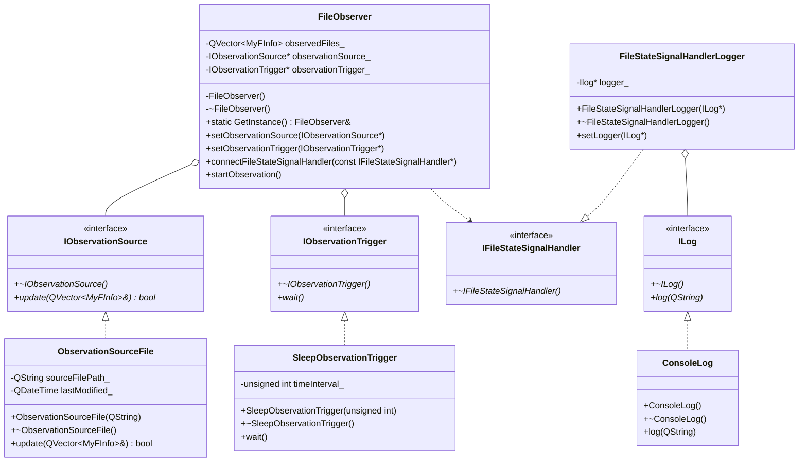

# Технологии программирования. Лабораторная работа №1
## [Наблюдение за файлами]
> **Селезнев Илья Дмитриевич** группа 932223

## Постановка задачи
Написать программу с консольным интерфейсом, которая выполняет слежение за выбранными файлами.

Ограничимся двумя характеристиками за изменениями которых выполняется слежение  :
1. Существование файла;
2. Размер файла.

Программа будет выводить на консоль уведомление о произошедших изменениях в файле.

Существует несколько ситуаций для наблюдаемого файла:
1. Файл существует, файл не пустой - на экран выводится факт существования файла и его размер.
2. Файл существует, файл был изменен - на экран выводится факт существования файла, сообщение о том что файл был изменен и его размер.  
3. Файл не существует - на экран выводится информация о том что файл не существует.

При возникновении изменения состояния наблюдаемого файла (возникновение события), необходимо выводить на экран соответствующее сообщение.
В данной реализации используем механизм сигнально-слотового соединения для обеспечения обработки события изменения наблюдаемого файла.

## Решение
### UML-диаграмма классов

### Диаграмма сигналов/слотов

## Тестирование
### Пользовательские тест-кейсы

#### Case №1
Проверка запуска с корректным файлом со списком наблюдения
* Входные параметры: файл со списком наблюдения существует и доступен для чтения
	* Шаг 1 - выполнить запуск приложения
	* Шаг 2 - ввести путь до файла со списком наблюдения / прописать хардкодом
* Результат: наблюдение начнется и не завершится, в консоли выводится " Observation started." но не "Observation ended."

#### Case №2
Проверка запуска с некорректным файлом со списком наблюдения
* Входные параметры: файл со списком наблюдения не существует или не доступен для чтения
	* Шаг 1 - выполнить запуск приложения
	* Шаг 2 - ввести путь до файла со списком наблюдения / прописать хардкодом
* Результат: наблюдение начнется  и сразу завершится, в консоли выводится " Observation started." и "Observation ended."

#### Case №3
Проверка добавления файла под наблюдение
* Входные параметры: файла 2.txt нет в списке наблюдения
	* Шаг 1 - прописать путь до файла 2.txt в список наблюдения, сохранить изменения
* Результат: в консоль выводится текущее состояние файла 2.txt (существует [размер]/не существует)

#### Case №4
Проверка изменения файла
* Входные параметры: файл 1.txt находится в списке наблюдения
	* Шаг 1 - Дописать символ "q" в 1.txt, сохранить изменения
	* Шаг 2 - Заменить символ "q" на "w" в 1.txt, сохранить изменения
* Результат: после каждого шага в консоль выводится сообщение об изменения файла, новый размер и время изменения
	
#### Case №5
Проверка удаления и повторного создания файла
* Входные параметры: файл 1.txt находится в списке наблюдения
	* Шаг 1 - Удалить файл 1.txt
	* Шаг 2 - Повторно создать файл 1.txt
* Результат: сначала в консоль выводится сообщение об отсутствии, затем сообщение о существования файла

#### Case №6
Проверка удаления файла из под наблюдения
* Входные параметры: файл 1.txt находится в списке наблюдения
	* Шаг 1 - удалить путь до файла 1.txt в списке наблюдения, сохранить изменения
	* Шаг 2 - изменить файл 1.txt
* Результат: сообщения о новых событих с файлом 1.txt в консоли не появляются

#### Case №7
Проверка выхода из цикла наблюдения
* Входные параметры: работает цикл наблюдения
	* Шаг 1 - удалить/переименовать файл со списком наблюдения
* Результат: в консоли выводится "Observation ended.", сообщения о новых событях с файлами в консоли не появляются