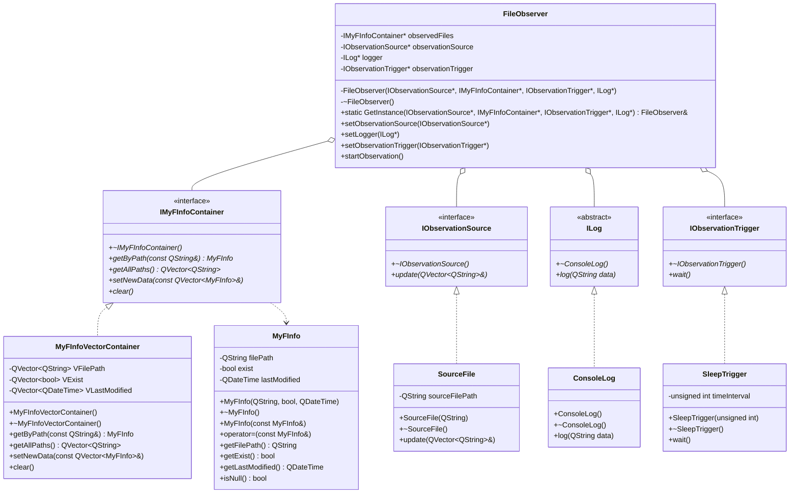

# FileWardenApp
# Технологии программирования. Лабораторная работа №1
## [Наблюдение за файлами]
> **Селезнев Илья Дмитриевич** группа 932223

##Постановка задачи
Написать программу с консольным интерфейсом, которая выполняет слежение за выбранными файлами.

Ограничимся двумя характеристиками за изменениями которых выполняется слежение  :
1. Существование файла;
2. Размер файла.

Программа будет выводить на консоль уведомление о произошедших изменениях в файле.

Существует несколько ситуаций для наблюдаемого файла:
1. Файл существует, файл не пустой - на экран выводится факт существования файла и его размер.
2. Файл существует, файл был изменен - на экран выводится факт существования файла, сообщение о том что файл был изменен и его размер.  
3. Файл не существует - на экран выводится информация о том что файл не существует.

При возникновении изменения состояния наблюдаемого файла (возникновение события), необходимо выводить на экран соответствующее сообщение.
В данной реализации используем механизм сигнально-слотового соединения для обеспечения обработки события изменения наблюдаемого файла.

### UML-диаграмма классов

